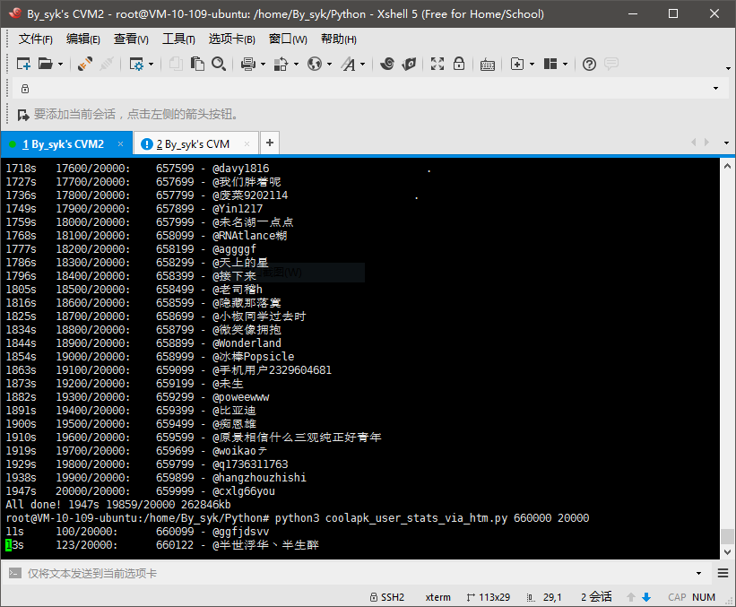

# 酷安用户数据爬虫案例


### 背景

「[酷安](http://www.coolapk.com)」是一个成长中的优秀国内应用社区。截至目前（201705），注册用户数在100万左右（当然，活跃用户并没有这么多）。
为了满足自己<u>了解酷安粉丝数排名情况</u>的好奇心，以及<u>学习实践 Python</u>，于是写了这个小玩意儿。


在此之前，已有酷友 [@unnamed5719](http://www.coolapk.com/u/547008) 基于 Python 实现对酷安全网用户的爬取分析，同时也开源了他的代码以及分析结果。（去查看：[酷安大数据（伪）](https://github.com/unnamed5719/coolapk-users)）
而这个小项目也是在其启发之下完成，感谢 @unnamed5719！


### 分析

每一位注册酷安的用户会获得一个唯一的ID，这些ID从`10001`开始依次递增。

如何获取每个用户的数据呢？有两个方案：
+ 1. 解析酷安用户网页

  ~`http://www.coolapk.com/u/{uid}`~

  `http://www.coolapk.com/u/{uid}/album`

  

+ 2. 调用酷安APP的API

  `https://api.coolapk.com/v6/user/profile?uid={uid}`

  

比较：

|  | 方案一 | 方案二 |
| :---- | :---- | :---- |
| 速度 | 快 | 慢 |
| 信息量 | 少（`用户名`、`粉丝数`、`动态数`、`关注APP数`、`发现APP数`） | 多（除方案一提及的，还有`性别`、`应用集数`等） |
| 其他 |  | 接口需要的`X-App-Token`值难于构造 |

这两个方案，均已实现。以下仅以方案一为例进行说明。

> 获取的这些数据包括用户隐私信息吗？
>
> 不会涉及到酷安用户隐私。抓取的这些数据均为酷安已公开的用户数据。


### 准备

##### 运行系统：Ubuntu 14

##### 数据库：MySQL 5.5

```
apt-get update
apt-get upgrade
apt-get install mysql-server
apt-get install mysql-client
```

```
CREATE DATABASE coolapk;
USE coolapk;
CREATE TABLE user(
    id INT PRIMARY KEY,
    name VARCHAR(64),
    fan INT DEFAULT 0,
    feed INT DEFAULT 0,
    app INT DEFAULT 0,
    find INT DEFAULT 0,
    time TIMESTAMP NOT NULL DEFAULT CURRENT_TIMESTAMP);
```

##### 开发语言：Python 3

```
apt-get install python3
apt-get install python3-pip
pip3 install pymysql
pip3 install sqlalchemy
```


### GO！

以每次处理10000用户的节奏，进行100次执行。

```
python3 coolapk_user_stats_via_htm.py 10000 10000
python3 coolapk_user_stats_via_htm.py 20000 10000
python3 coolapk_user_stats_via_htm.py 30000 10000
...
```



以腾讯家的云服务器（配置：单核/1GB/1Mbps）为例，
+ 每秒平均处理`10.2`个用户
+ 每个用户平均消耗`13.14`KB流量

那么，按酷安百万用户计，
+ 大概耗时`1634`min（`27`h）（单机单线程）
+ 大约消耗`12.5`GB流量

如果使用多台机器同时跑，可在数小时内完成。

### 结果

> 以下统计基于 `2017-05-19` - `2017-05-22` 时间段采集的数据

##### 用户数

```
SELECT COUNT(*) FROM user;
```

注册用户数：`929322` **93万**

```
SELECT COUNT(*) FROM user WHERE fan = 0 AND feed = 0 AND app = 0 AND find = 0;
```

沉睡用户数：`384345` **38万，占比41%**

##### 评分排名TOP100

设定评分计算规则：

|  | 粉丝数 | 动态数 | 关注APP数 | 发现APP数 |
| :---- | :----: | :----: | :----: | :----: |
| 权值 | 0.50 | 0.40 | 0.08 | 0.02 |

> 各项权值由我个人随意设定，因此以下数据仅供参考。

```
SELECT
    @rownum:=@rownum+1 AS '#',
    CONCAT('[@', name, '](http://www.coolapk.com/u/', id, ')') AS 'user',
    FLOOR(fan * 0.5 + feed * 0.4 + app * 0.08 + find * 0.02) AS 'score',
    fan, feed, app, find
FROM
    user, (SELECT @rownum:=0) temp
ORDER BY
    score DESC
LIMIT 100;
```

| # | 酷友 | 评分 | 粉丝数 | 动态数 | 关注APP数 | 发现APP数 |
| ----: | :---- |  :---- | :---- | :---- | :---- | :---- |
|   1 | [@酷安小编](http://www.coolapk.com/u/12202)         |  8860 | 15374 | 2869 |  179 |  595 |
|   2 | [@八百标兵](http://www.coolapk.com/u/408649)        |  7727 | 12784 | 3193 |  424 | 1205 |
|   3 | [@辣椒爱上水果](http://www.coolapk.com/u/539641)    |  5761 | 11509 |   16 |    5 |    0 |
|   4 | [@夜之浪子](http://www.coolapk.com/u/392418)        |  4189 |  2144 | 7747 |   53 |  724 |
|   5 | [@pandecheng](http://www.coolapk.com/u/531994)      |  3146 |  2720 | 3072 | 6836 |  535 |
|   6 | [@tastypear](http://www.coolapk.com/u/97100)        |  2989 |  4778 | 1478 |   16 |  383 |
|   7 | [@尘封之泪](http://www.coolapk.com/u/323469)        |  2984 |  5661 |  384 |    4 |    0 |
|   8 | [@阿酷](http://www.coolapk.com/u/10002)             |  2706 |  4396 | 1255 |   44 |  162 |
|   9 | [@zesty](http://www.coolapk.com/u/257251)           |  2695 |  3113 | 2741 |    2 | 2114 |
|  10 | [@小浅丶](http://www.coolapk.com/u/621284)          |  2349 |  4637 |   76 |    4 |    1 |
|  11 | [@柚木舟](http://www.coolapk.com/u/501659)          |  2318 |  4500 |  155 |   82 |    0 |
|  12 | [@Fince](http://www.coolapk.com/u/506292)           |  2122 |   864 | 4003 | 1109 |   24 |
|  13 | [@various](http://www.coolapk.com/u/441319)         |  2056 |  4054 |   64 |   41 |    9 |
|  14 | [@fkzhang](http://www.coolapk.com/u/517328)         |  2053 |  4058 |   60 |    0 |    0 |
|  15 | [@DBin_K](http://www.coolapk.com/u/523048)          |  1941 |  1278 | 3214 |  193 |   90 |
|  16 | [@黄福林](http://www.coolapk.com/u/514025)          |  1743 |  2593 | 1117 |    1 |    7 |
|  17 | [@iKirby](http://www.coolapk.com/u/196164)          |  1734 |  2470 | 1008 | 1192 |   24 |
|  18 | [@绯色の炎](http://www.coolapk.com/u/474608)        |  1626 |   281 | 2851 | 4313 |   16 |
|  19 | [@zhou45](http://www.coolapk.com/u/477727)          |  1566 |  3101 |   41 |    0 |    4 |
|  20 | [@lyh123](http://www.coolapk.com/u/419201)          |  1447 |   488 | 2671 | 1608 |  298 |
|  21 | [@feemo](http://www.coolapk.com/u/465758)           |  1404 |  1162 | 1925 |  506 |  641 |
|  22 | [@没有密码找回](http://www.coolapk.com/u/450035)    |  1345 |  2646 |   55 |    1 |    1 |
|  23 | [@Hiapkangel](http://www.coolapk.com/u/329466)      |  1334 |  1712 | 1160 |  176 |    7 |
|  24 | [@EMK2000](http://www.coolapk.com/u/381916)         |  1279 |   692 | 2276 |   95 |  772 |
|  25 | [@西瓜菌](http://www.coolapk.com/u/451478)          |  1278 |  1597 | 1161 |  182 |   61 |
|  26 | [@婷媌](http://www.coolapk.com/u/545518)            |  1247 |  2354 |  176 |    2 |    5 |
|  27 | [@哈尼小姐姐](http://www.coolapk.com/u/750486)      |  1237 |  2263 |  245 |  105 |    1 |
|  28 | [@阿明1975](http://www.coolapk.com/u/314635)        |  1197 |   103 | 2760 |    1 | 2075 |
|  29 | [@Brevent](http://www.coolapk.com/u/689514)         |  1179 |  2334 |   29 |    5 |    1 |
|  30 | [@PandaTV](http://www.coolapk.com/u/517019)         |  1177 |  2184 |  156 |  286 |    8 |
|  31 | [@Trumeet](http://www.coolapk.com/u/543424)         |  1174 |  2073 |  181 |  820 |    5 |
|  32 | [@微信撩骚](http://www.coolapk.com/u/311545)        |  1163 |   115 | 2722 |  212 |   11 |
|  33 | [@veryyoung](http://www.coolapk.com/u/487919)       |  1153 |  2289 |   21 |    5 |    5 |
|  34 | [@狐狸等花开](http://www.coolapk.com/u/470401)      |  1139 |  2269 |   13 |    0 |    0 |
|  35 | [@手谈姬](http://www.coolapk.com/u/493951)          |  1139 |  2211 |   84 |    0 |    7 |
|  36 | [@By_syk](http://www.coolapk.com/u/463675)          |  1127 |  1750 |  571 |  289 |   32 |
|  37 | [@suesyria](http://www.coolapk.com/u/382848)        |  1126 |   563 | 1807 | 1353 |  702 |
|  38 | [@少女的酥胸_](http://www.coolapk.com/u/623372)     |  1090 |  2023 |  198 |    1 |    1 |
|  39 | [@Aviraxp](http://www.coolapk.com/u/527859)         |  1027 |  1390 |  829 |    2 |   33 |
|  40 | [@顾挽歌](http://www.coolapk.com/u/628150)          |  1025 |  2007 |   51 |   15 |    1 |
|  41 | [@狼大](http://www.coolapk.com/u/477888)            |  1023 |  1825 |  222 |  279 |    0 |
|  42 | [@Pandaria](http://www.coolapk.com/u/690388)        |  1020 |  1899 |  177 |    7 |    4 |
|  43 | [@千舞梦三](http://www.coolapk.com/u/474553)        |  1019 |   302 | 2132 |   89 |  415 |
|  44 | [@风澈](http://www.coolapk.com/u/593750)            |   995 |  1952 |   27 |  107 |    1 |
|  45 | [@llllllllllll666](http://www.coolapk.com/u/554126) |   964 |   621 | 1591 |  207 |   34 |
|  46 | [@讞諳](http://www.coolapk.com/u/386254)            |   961 |  1289 |  746 |  166 |  255 |
|  47 | [@茶杯](http://www.coolapk.com/u/440723)            |   934 |  1327 |  666 |   15 |  160 |
|  48 | [@维生素茜](http://www.coolapk.com/u/472448)        |   933 |   226 | 1961 |  446 |   27 |
|  49 | [@SDRAGON](http://www.coolapk.com/u/485095)         |   924 |  1742 |   60 |  370 |    3 |
|  50 | [@科学松鼠会](http://www.coolapk.com/u/284165)      |   911 |   360 | 1793 |   87 |  377 |
|  51 | [@atony](http://www.coolapk.com/u/474222)           |   904 |  1382 |  514 |   75 |   70 |
|  52 | [@wuxianlin](http://www.coolapk.com/u/383342)       |   902 |  1793 |   15 |    1 |    0 |
|  53 | [@Time_](http://www.coolapk.com/u/673294)           |   901 |  1730 |   92 |    1 |    0 |
|  54 | [@LetITFly](http://www.coolapk.com/u/515292)        |   896 |  1791 |    3 |    3 |    1 |
|  55 | [@noear](http://www.coolapk.com/u/483139)           |   893 |  1206 |  725 |    4 |    5 |
|  56 | [@liubaoyua](http://www.coolapk.com/u/346976)       |   884 |  1408 |  420 |  147 |   33 |
|  57 | [@Kanmurimori](http://www.coolapk.com/u/458108)     |   883 |   402 | 1502 |  994 |  122 |
|  58 | [@QQ2223274676](http://www.coolapk.com/u/495450)    |   848 |    33 | 2064 |   82 |    3 |
|  59 | [@tyzrj766](http://www.coolapk.com/u/362582)        |   846 |    26 | 1952 |  654 |    8 |
|  60 | [@Dr_Pure](http://www.coolapk.com/u/446137)         |   841 |   290 | 1714 |  118 |   79 |
|  61 | [@小李熹熹](http://www.coolapk.com/u/798207)        |   841 |  1665 |   21 |    9 |    0 |
|  62 | [@虎小八](http://www.coolapk.com/u/467851)          |   839 |   609 | 1209 |  640 |    4 |
|  63 | [@tieaa](http://www.coolapk.com/u/418290)           |   838 |   681 |  703 | 2640 |  259 |
|  64 | [@潇湘夜雨缘](http://www.coolapk.com/u/492837)      |   837 |  1513 |  174 |  137 |    6 |
|  65 | [@一字](http://www.coolapk.com/u/200433)            |   828 |    42 | 1988 |  129 |  103 |
|  66 | [@寒歌](http://www.coolapk.com/u/675594)            |   808 |  1244 |  464 |   11 |    1 |
|  67 | [@martincz](http://www.coolapk.com/u/187424)        |   795 |  1526 |   79 |    4 |    4 |
|  68 | [@初音是谁](http://www.coolapk.com/u/411079)        |   791 |   292 | 1497 |  564 |   73 |
|  69 | [@Leon连续](http://www.coolapk.com/u/532152)        |   789 |  1563 |   17 |   13 |    2 |
|  70 | [@haseoxth](http://www.coolapk.com/u/398370)        |   787 |    74 | 1843 |  154 |   66 |
|  71 | [@囧机油aprilone](http://www.coolapk.com/u/302681)  |   783 |   116 |  707 | 5536 |    0 |
|  72 | [@solovid](http://www.coolapk.com/u/146933)         |   781 |    21 | 1911 |   70 |   41 |
|  73 | [@风居住的街道](http://www.coolapk.com/u/467160)    |   774 |  1432 |   82 |  324 |    1 |
|  74 | [@八雲紫](http://www.coolapk.com/u/477309)          |   769 |   386 | 1438 |    3 |   59 |
|  75 | [@iVanilla](http://www.coolapk.com/u/651701)        |   756 |   529 | 1227 |   11 |    6 |
|  76 | [@zfj012](http://www.coolapk.com/u/455740)          |   753 |  1188 |  200 |  996 |    2 |
|  77 | [@少侠就是我啊](http://www.coolapk.com/u/427824)    |   751 |   102 | 1610 |  700 |   18 |
|  78 | [@我是笑话](http://www.coolapk.com/u/485637)        |   745 |   200 | 1573 |  193 |   49 |
|  79 | [@Android_L_User](http://www.coolapk.com/u/524069)  |   739 |  1236 |  303 |    2 |    8 |
|  80 | [@郁闷人](http://www.coolapk.com/u/456215)          |   731 |   378 | 1344 |   61 |   10 |
|  81 | [@UBIKS](http://www.coolapk.com/u/375211)           |   723 |   897 |  665 |   96 |   83 |
|  82 | [@苏阿墨](http://www.coolapk.com/u/396702)          |   718 |    23 |  140 | 8134 |    0 |
|  83 | [@安卓大帝](http://www.coolapk.com/u/275421)        |   717 |   574 | 1075 |    0 |   10 |
|  84 | [@mooooo](http://www.coolapk.com/u/430832)          |   712 |   111 | 1631 |   43 |   56 |
|  85 | [@xyphillipyx](http://www.coolapk.com/u/24080)      |   698 |  1220 |  216 |   15 |   24 |
|  86 | [@yuki918](http://www.coolapk.com/u/114699)         |   689 |  1172 |  258 |    0 |    3 |
|  87 | [@n5202853](http://www.coolapk.com/u/511550)        |   682 |  1305 |    5 |  346 |    9 |
|  88 | [@丿魸](http://www.coolapk.com/u/297328)            |   680 |   101 | 1489 |  409 |   81 |
|  89 | [@chendeshen](http://www.coolapk.com/u/306952)      |   677 |    18 |   86 | 7924 |    4 |
|  90 | [@lqmouse](http://www.coolapk.com/u/195461)         |   674 |     6 |  221 | 7292 |    0 |
|  91 | [@Misaka9903](http://www.coolapk.com/u/433159)      |   664 |  1163 |  167 |  195 |    6 |
|  92 | [@七曜之律](http://www.coolapk.com/u/435498)        |   663 |   327 | 1138 |  528 |  128 |
|  93 | [@酷宇小编](http://www.coolapk.com/u/245902)        |   662 |    33 | 1581 |  167 |    1 |
|  94 | [@gujiangjiang](http://www.coolapk.com/u/151454)    |   659 |    39 | 1596 |   19 |   24 |
|  95 | [@fairyex](http://www.coolapk.com/u/466253)         |   658 |  1250 |   82 |    2 |    2 |
|  96 | [@Resume](http://www.coolapk.com/u/568993)          |   654 |   941 |  456 |    3 |   56 |
|  97 | [@蓝莓味绿茶](http://www.coolapk.com/u/238725)      |   653 |   966 |  422 |   25 |    9 |
|  98 | [@Kiriya](http://www.coolapk.com/u/271927)          |   653 |   160 | 1306 |  631 |   15 |
|  99 | [@zjszjs](http://www.coolapk.com/u/499404)          |   648 |    23 | 1130 | 2311 |    0 |
| 100 | [@wszxf](http://www.coolapk.com/u/504087)           |   647 |   168 | 1290 |  558 |  147 |

> 如何在数据库中查询指定用户的评分情况？
> ```
> SELECT
>     *
> FROM
>     (SELECT
>         @rownum:=@rownum+1 AS '#',
>	  id, name, fan, feed, app, find,
>		  FLOOR(fan * 0.5 + feed * 0.4 + app * 0.08 + find * 0.02) AS 'score'
>	  FROM
>	      user, (SELECT @rownum:=0) temp
>	  ORDER BY
>		  score DESC
>      ) stats
>  WHERE
>      name = 'xxx';
> ```


### License

    Copyright 2017 By_syk

    Licensed under the Apache License, Version 2.0 (the "License");
    you may not use this file except in compliance with the License.
    You may obtain a copy of the License at

       http://www.apache.org/licenses/LICENSE-2.0

    Unless required by applicable law or agreed to in writing, software
    distributed under the License is distributed on an "AS IS" BASIS,
    WITHOUT WARRANTIES OR CONDITIONS OF ANY KIND, either express or implied.
    See the License for the specific language governing permissions and
    limitations under the License.


*Copyright &#169; 2017 By_syk. All rights reserved.*